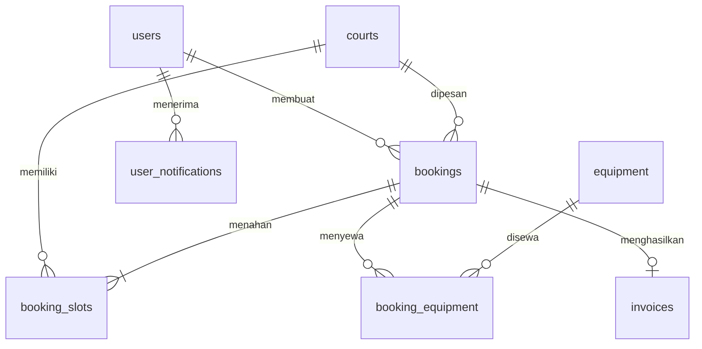

```mermaid
erDiagram
    users ||--o{ bookings : membuat
    users ||--o{ user_notifications : menerima
    courts ||--o{ bookings : dipesan
    courts ||--o{ booking_slots : memiliki
    bookings ||--|{ booking_slots : menahan
    bookings ||--o{ booking_equipment : menyewa
    equipment ||--o{ booking_equipment : disewa
    bookings ||--o| invoices : menghasilkan
```